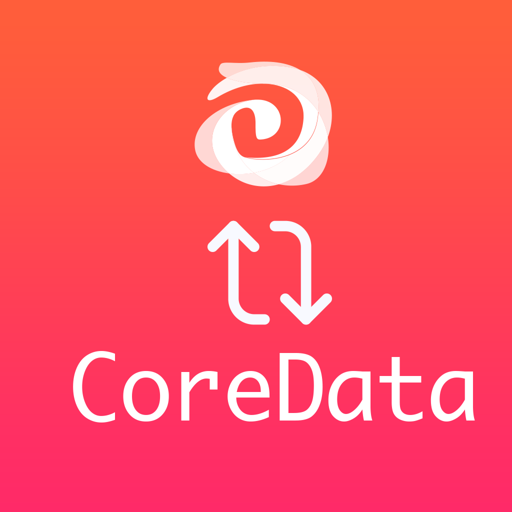

# CoreDataDitto

[](https://travis-ci.org/2183729/CoreDataDitto)
[](https://cocoapods.org/pods/CoreDataDitto)
[](https://cocoapods.org/pods/CoreDataDitto)
[](https://cocoapods.org/pods/CoreDataDitto)



This is an __experimental__ library that watches CoreData changes and reflects them into Ditto. Any Ditto `.update` observable events are insert, updated, or removed from CoreData
## Example

To run the example project, clone the repo, and run `pod install` from the Example directory first.
(Currently the example is useless, please see the XCTest cases instead!)

## Requirements

1. Clone this repo
2. At the root of this repo run `touch license_token.txt` and paste in a valid license token.
3. Paste in a valid license token.
## Installation

CoreDataDitto is available through [CocoaPods](https://cocoapods.org). To install
it, simply add the following line to your Podfile:

```ruby
pod 'DittoSwift', '~> 1.0.4'
pod 'CoreDataDitto'
```

## Quick Start

This library adds an extension method called `.bind` to `NSManagedObjectContext`. The method takes 3 parameters:

1. You ditto instance (it should already be started if you want to sync with peers)
2. A typed KeyPath to the "primary key" property. Use the syntax like : `\Task.id` or `\MyThing.myPrimaryKey`
3. The binder will have a callback with the snapshots of the `NSManagedObject`
4. 

```swift
// 1
import DittoSwift
import CoreDataDitto

let managedObjectContext: NSManagedObjectContext

let token = managedObjectContext.bind(to: ditto, primaryKeyPath: \Task.id, collectionName: "tasks") { items in
    self.tasks = items
    self.tableView.reloadData()
}
```

## Architecture

CoreDataDitto will attempt to sync changes from a CoreData entity using a `NSFetchResult` with a corresponding `DittoPendingCursorOperation`. For example, if you have a `MenuItem` model from CoreData, you'll want to sync it with the `menuItem` Ditto collection.

1. When you call `bind`, first it'll loop through all CoreData objects and force Ditto match it. Any ditto documents that are not in core data will be removed.
2. Then it will start a liveQuery to observe the entire collection and reflect ditto `.update` changes into `NSManagedObject` entities of the same type
3. `CoreDataDitto` internally uses a `NSFetchResultsController` to observe edits to CoreData objects and will translate them into Ditto `insert`, `update`, and `remove` operations

Important:

This library does _not_ handle relationships and will attempt to sync the _entire_ entities 

## Author

Ditto (contact@ditto.live)

## License

CoreDataDitto is available under the MIT license. See the LICENSE file for more info.
